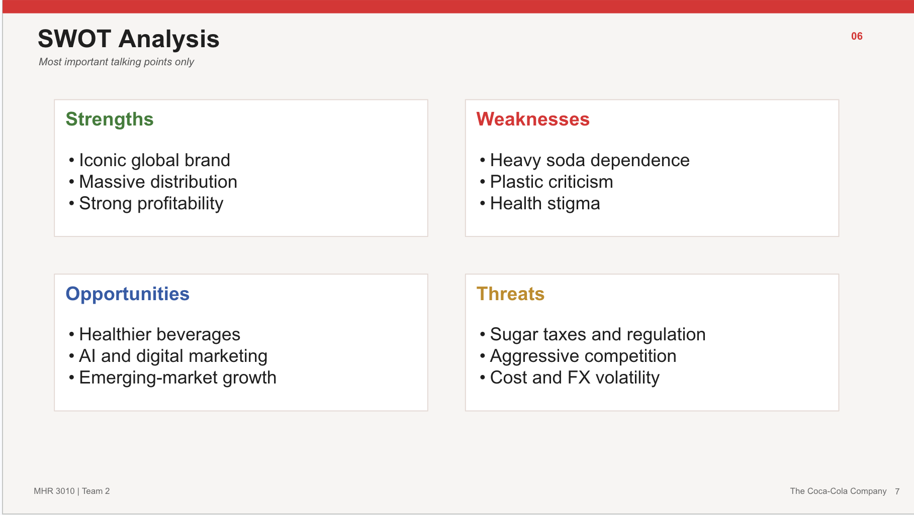
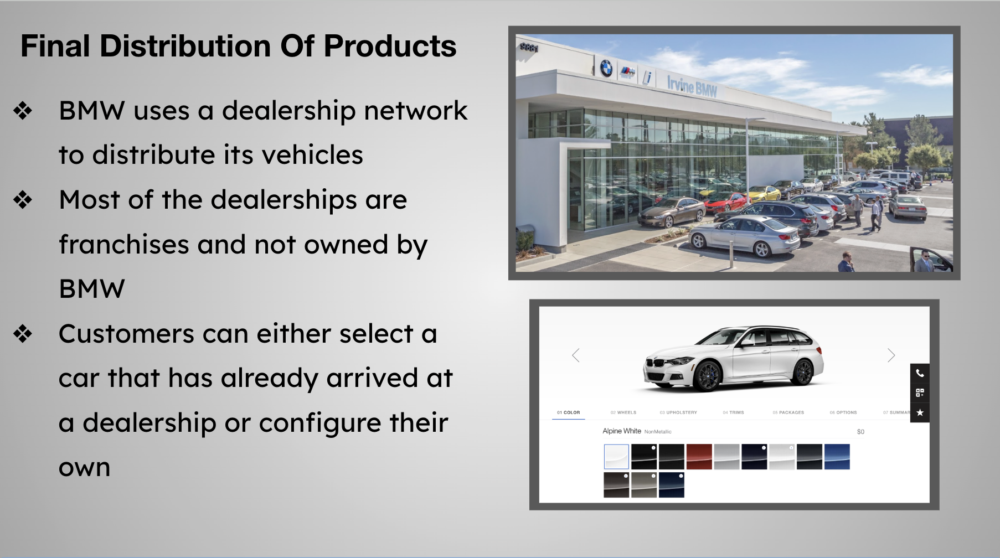

Below are selected projects that showcase my work in school projects.These projects involve data analytics and market research.

## MHR 3010 Group Presentation

For this project, I presented on the strengths, weaknesses, opportunities, and threats of the Coca-Cola company.

**Skills Demonstrated:**

- **Data Analysis:** Gathered relevant information to determine company factors.
- **Team Coordination:** Collaborated with group members on paper and presentation.
- **Public Speaking:** Presented data in front of audience properly.
- **Postproject Editing:** Taking in feedback and adjusting analysis.

---

## ACC 2080 Group Presentation

For this project, I focused on the distribution of BMW's cars and dealership network. I then created and presented on my slides in our group project.

**Skills Demonstrated:**

- **Distribution Analysis:** Analyzed various aspects of supply chain.
- **Group Collaboration:** Worked with teammates during and outside of class.
- **Presentation Creation:** Used Google Slides to present upon topic.

---